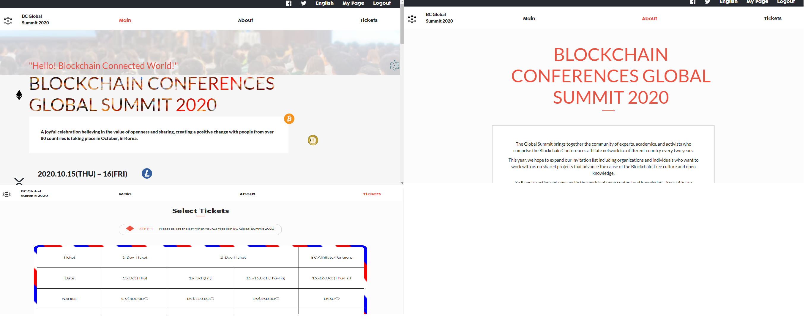

# Capstone Project Conference Page

The Microverse Capstone project for the HTML and CSS module where I got assigned to build a website for a Conference Page and I decided to go for A Blockchain Conference Page. It needed to comply with the requirements: 

- At least 3 pages, the main page, the about page and the tickets page.

- Each of the pages should have versions of 2 different screen sizes mobile up to 768px and desktop from 768px.

- Use of the Font Family Cocogoose and Lato.

- Use of the colors #272A31, #EC5242 #D3D3D3.

## Built With

- HTML
- CSS tecnologies such as flexbox, grids, linear-gradients and more.
- Sass a CSS preprocessor
- Bootstrap framework
- SVG's
- Google API's Font

## Author

- 👤GitHub: [Jose Abel Ramirez](https://github.com/jose-Abel)
- Linkedin: [Jose Abel Ramirez Frontany](https://www.linkedin.com/in/jose-abel-ramirez-frontany-7674a842/)

## Getting Started

You can clone this code anytime and load the HTML on your browser, because it has SVG's needs to be loaded on a webserver so you could install the live-server package in order to display the SVG's.

## Live version
[live version](https://jose-abel-conference-page.netlify.app/)

### Setup

You can either copy the code with git clone or just do a git pull on your local environment.

### Run tests

We run the tests for the linters.yml file and everything pass!

### Acknowledgments

Appreciate the teams at Google Font's API, helps coding amazing webpages faster.

A special thanks to the designer of the website Cindy Shin in Behance https://www.behance.net/adagio07.

A thanks to srip a designer that design the blockchain.svg that I've downloaded from the website https://www.flaticon.es/icono-gratis/blockchain_2091556#

Also an acknowledgment to Microverse for pushing us further to increase our knowledge.

## 📝 License

This project is MIT licensed.

## Show your support

Give a ⭐️ if you like this project!
